# Tutorial Git
Questo file contiene un tutorial per configurare il proprio account **GitHub** e imparare i principali comandi di **Git**.
Inoltre viene spiegato come scaricare e consegnare i laboratori tramite **GitHub Classroom**.
Prima di procedere consultare la guida software.

## Indice
1. [Creazione repository laboratorio](#creazione-repository-laboratorio)
2. [Guida VSCode (for NOOBs)](#guida-vscode-for-noobs)
    1. [Clone repository](#clone-repository)
    2. [Staging and committing changes](#staging-and-committing-changes)
    3. [Push changes](#push-changes)
    4. [Fetch and pull changes](#fetch-and-pull-changes)
3. [Guida PyCharm (for NOOBs)](#guida-pycharm-for-noobs)
    1. [Clonare repository](#clonare-repository)
    2. [Staging and committing](#staging-and-committing)
    3. [Aggiornamento repository remoto (push)](#aggiornamento-repository-remoto-push)
    4. [Aggiornamento repository locale (fetch/pull)](#aggiornamento-repository-locale-fetchpull)
4. [Guida terminale](#guida-terminale)
    1. [Generazione token](#generazione-token)
    2. [Configurazione client Git](#configurazione-client-git)
    3. [Checkout repository (git clone)](#checkout-repository-git-clone)
    4. [Staging (git add)](#staging-git-add)
    5. [Commit (git commit)](#commit-git-commit)
    6. [Aggiornamento repository remoto (git push)](#aggiornamento-repository-remoto-git-push)
    7. [Aggiornamento repository locale (git fetch/pull)](#aggiornamento-repository-locale-git-fetchpull)
    8. [Ignorare file (.gitignore)](#ignorare-file-gitignore)
5. [Conflitti](#conflitti)
6. [Riferimenti](#riferimenti)

## Creazione repository laboratorio
Creare un account **GitHub**. Usare email e username che si preferiscono,
non devono per forza essere quelli istituzionali.

Il link per ciascun laboratorio verrà fornito dal docente ogni settimana.
Cliccare sul link del primo laboratorio, selezionare il proprio nome (**NON SBAGLIATE!!**).
**Github Classroom** creerà un repository per voi contenete la traccia del laboratorio.

Accedere al primo laboratorio tramite link di modo che venga creato il vostro repository.

## Guida VSCode (for NOOBs)
Questa sezione mostra come usare *Git* tramite l'interfaccia grafica di **VSCode**.

**ATTENZIONE**: Se si sta svolgendo sui PC del laboratorio, cercare ``Default apps`` nella barra di ricerca di Windows,
e settare Chrome come browser predefinito.

### Clone repository
Aprire **VSCode** e nella schermata iniziale premere su ```Clone Git Repository```.
Se si ha già un progetto aperto, o la pagina iniziare è stata chiusa,
è possibile accedere alla stessa funzione tramite la barra laterale.

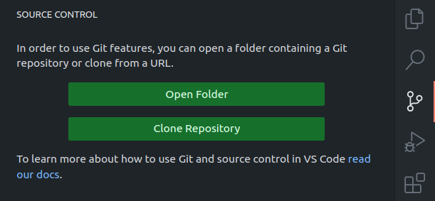

Nel menù che si apre selezionare ```Clone from GitHub```,
e nel messaggio che seguirà permettere all'estensione di fare il sign in premendo su ```Allow```.
Si verrà inviati sul sito di GitHub, dove si dovrà effettuare il login al proprio account.
Se viene chiesto di autorizzare GitHub per VSCode, accettare la richiesta.

Una volta fatto, nel browser comparirà un messaggio chiedendo di aprire VSCode.
Premendo su ```Open Visual Studio Code``` si verrà inviati nuovamente a VSCode.
Accettare eventuali richieste aggiuntive da parte di VSCode.

Se comparisse il messaggio ```Having trouble loggin in?```,
premere su ```Yes``` per essere inviati a una nuova finestra del browser.
Se viene chiesto solamente ora di autorizzare GitHub per VSCode, accettare la richiesta.
Si verrà nuovamente inviati a VSCode o verrà richiesto di farlo manualmente.

A questo punto se il messaggio ```Having trouble loggin in?``` è ancora presente,
premere di nuovo su ```Yes``` e seguire le istruzioni.
Si potrebbe essere inviati nuovamente al browser per inserire un codice di autenticazione.
Questo verrà copiato automaticamente nella clipboard e basterà incollarlo usando il tasto destro.

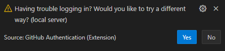

Se ci sono problemi con la procedura, chiudere VSCode e riprovare.
Una volta terminata la configurazione, sarà possibile selezionare il repository da clonare.
Selezionare il primo laboratorio.
**ATTENZIONE**: selezionare la versione con il vostro nome utente, l'altra non permette di caricare le modifiche.

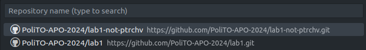

Una volta selezionato, indicare la cartella in cui si vuole salvare il repository, e confermare.
**VSCode** clonerà il progetto tramite **Git** e aprirà la cartella una volta finito il download.
Se viene chiesto ```Do you trust the authors of the files in this folder?```, confermare.

### Staging and committing changes
Creare un nuovo file nel progetto (per esempio la soluzione al primo esercizio),
e fare una modifica a ```README.md``` (per esempio aggiungendo una riga bianca).

Andare nella sezione ```Source control``` tramite la barra laterale.
Qui sono elencate tutte le modifiche eseguite effettuate ai file del repository.
I file sono suddivisi tra file non tracciati (U) e file modificati (M).
È possibile aggiungere alla staging area i file che si vogliono includere nella prossima versione del repository,
cliccando sul pulsate ```+```.
Altrimenti è possibile rimuovere le modifiche cliccando sulla freccia ````↺````.

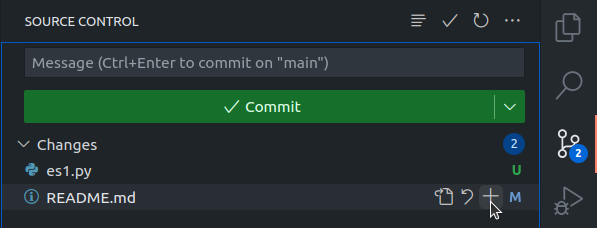

Aggiungere entrambe le modifiche, dopodiché inserire un messaggio ed effettuare il commit.
Evitare messaggi troppo generici: in futuro sarà utile per capire cos'è stato fatto.

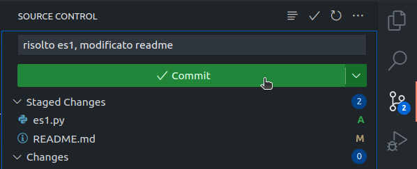

### Push changes
La versione locale ha ora un commit in più rispetto alla versione remote (**origin/main**).
Cliccando sul pulsante Sync Changes, in questo modo il repository remoto verrà sincronizzato con quello locale.

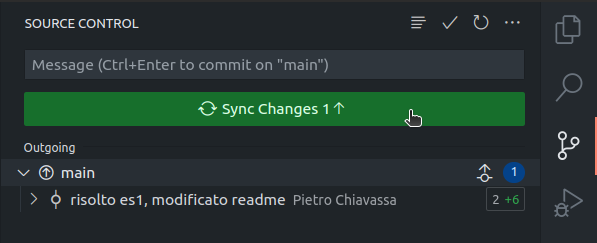


### Fetch and pull changes
Effettuare dei cambiamenti a ```README.md``` direttamente sul sito **Github**, per esempio rimuovendo una riga bianca.

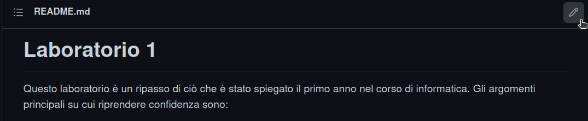

Una volta effettuato il cambiamento eseguire il commit sul repository remoto.

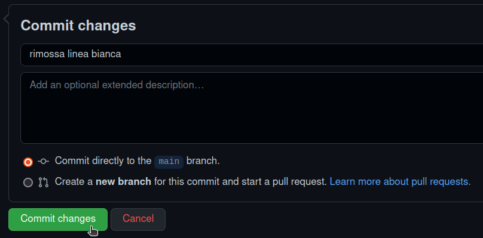

La versione locale non è ancora al corrente delle modifiche.
Per far si che vengano visualizzate occorre effettuare un fetch, 
aprendo il menù a tendina tramite il pulsante ```...``` nella sezione source control.

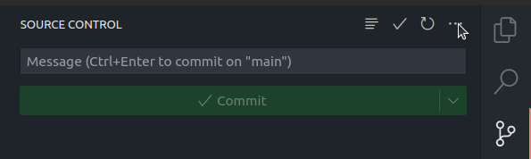

In questo modo il repository locale rimane al corrente delle verifiche remote,
che vengono visualizzate sotto la dicitura ```incoming```.

Per aggiornare il repository locale alla versione remota, è necessario effettuare un'operazione di pull.
Per farlo cliccare sul pulsante ```Synch Changes```.

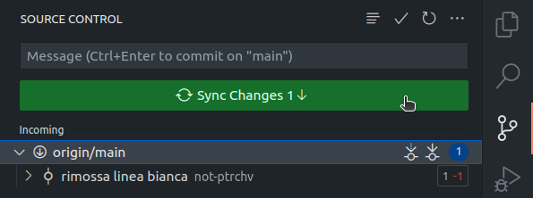

A questo punto la versione locale è nuovamente sincronizzata con quella remota.


## Guida PyCharm (for NOOBs)
Questa sezione mostra come usare *Git* tramite l'interfaccia grafica di **PyCharm**.

### Clonare repository
Aprire **PyCharm** e nella schermata iniziale premere su ```Get from VCS```.
Se si ha già un progetto aperto, per tornare alla schermata iniziare selezionare ```File -> close_project```.

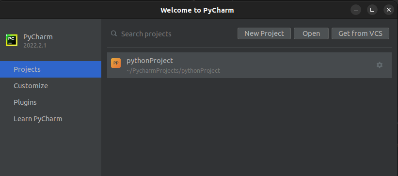

Nella finestra che andare nella sezione **Github** e premere su ```Login via Github``` e seguire la procedura.

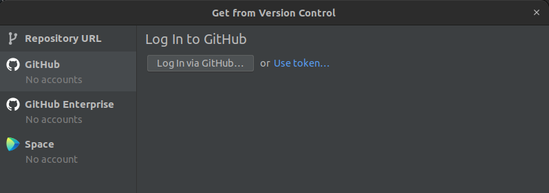

Quando viene chiesto di autorizzare **JetBrains** permettere (grant) anche l'accesso all'organizzazione ```PoliTo-APO```.

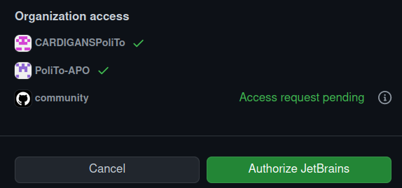

Una volta terminata la procedura, tornare a **PyCharm** e nella sezione **Github** selezionare il repository da clonare.

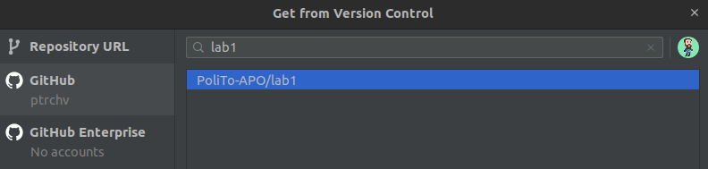

Indicare la cartella in cui si vuole salvare il repository, e premere su clone.
**PyCharm** clonerà il progetto tramite **Git** e aprirà il progetto una volta finito il download.

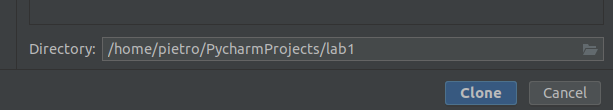


### Configurazione python
Creare un nuovo file nel progetto, per esempio contenere la soluzione al primo esercizio e inserire del codice.
PyCharm potrebbe mostrare un errore, richiedendo di configurare l'interprete.
Se l'errore non compare e riuscite a lanciare il programma, potete saltare alla prossima sezione.

Fare Click su ```Configure Python intepreter```,
nella finestrella selezionare ```interpreter settings -> add New interpreter -> Add local interpreter```.

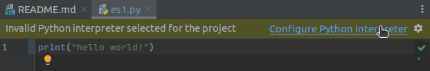

Nella finestra che si apre lasciare le impostazioni di default e premere su ```ok```.
L'errore dovrebbe scomparire e si potrà eseguire il codice.

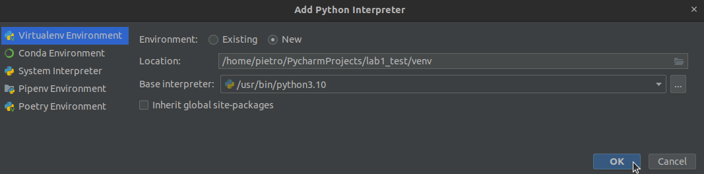


### Staging and committing
Creare un nuovo file nel progetto (per esempio la soluzione al primo esercizio), e fare una modifica a ```README.md``` (per esempio aggiungendo una riga bianca).
Andando nella sezione ```commit``` selezionare i file (ovvero le modifiche) che si vogliono aggiungere alla nuova versione (commit) del repository.
I file sono divisi tra file non tracciati e file modificati.
Aggiungere entrambe le modifiche, dopodiché inserire un messaggio ed effettuare il commit.
Evitare messaggi troppo generici: in futuro sarà utile per capire cos'è stato fatto.

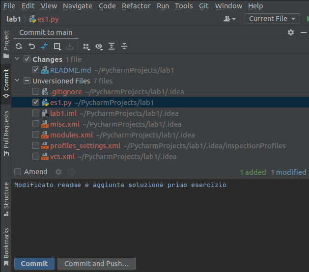

### Aggiornamento repository remoto (push)
Aprire la sezione git in basso, e notare che la versione locale ha un commit in più rispetto alla versione remote (**origin/main**).
Fare tasto destro sull'ultimo commit locale e selezionare ```push up to here```.
Se l'opzione non compare, nella finestrella a sinistra, fare tasto destro su ```Local/main``` e poi ```push```.
Nella finestra che si apre confermare premendo il pulsante ```push```.

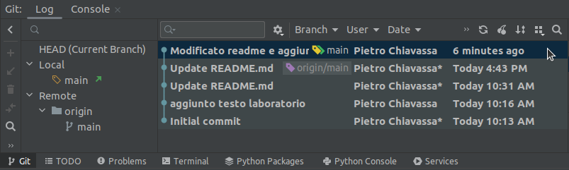

In questo modo il repository remoto si sincronizzerà con quello locale.
Come si nota ora nella sezione **Git**, ```origin/main``` e ```main``` coincidono.
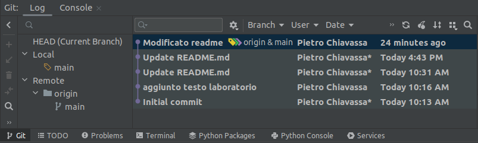


### Aggiornamento repository locale (fetch/pull)
Effettuare dei cambiamenti a ```README.md``` direttamente sul sito **Github**, per esempio rimuovendo una riga bianca.


Una volta effettuato il cambiamento eseguire il commit sul repository remoto.


La versione locale non è ancora al corrente delle modifiche.
Per far si che vengano visualizzate occorre effettuare un fetch, premendo l'opportuno pulsante.

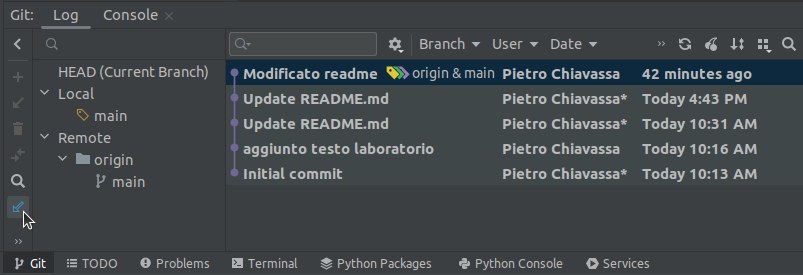

In questo modo il repository locale rimane al corrente delle verifiche remote.
Il main locale viene visualizzato come indietro rispetto a quello remoto origin/main

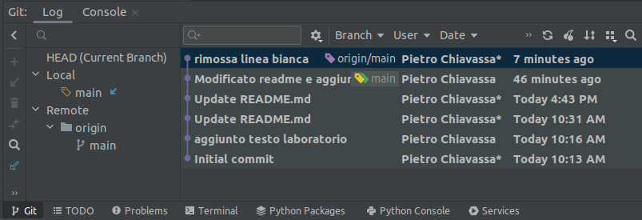

Per aggiornare il repository locale alla versione remota, è necessario effettuare un'operazione di pull.
Selezionare ```main``` nella casella di sinistra, e premere sul pulsante indicato per effettuare il pull.

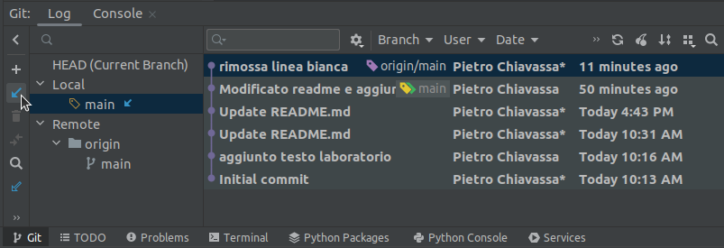

A questo punto la versione locale è nuovamente sincronizzata con quella remota.

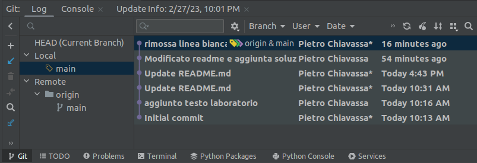

## Guida terminale
Questa sezione mostra come usare **Git** tramite terminale.
È molto utile per capire meglio come funziona **Git**, anche se le stesse cose si possono fare in PyCharm.

### Generazione token
Una volta creato l'account *GitHub*, generare un token seguendo la
[guida](https://docs.github.com/en/authentication/keeping-your-account-and-data-secure/creating-a-personal-access-token).
Per semplicità si può decidere che il token non scada mai (*expiration*).
Come ambito di validità (*scope*) selezionare solo la voce ```repo```.
Questo verrà utilizzato come password per accedere al repository da remoto tramite il client **Git**.

Un volta generato, il token non sarà più visibile, quindi è necessario salvarlo in un posto sicuro,
accessibile anche da casa.
Vi consiglio di utilizzare un password manager come [Bitwarden](https://bitwarden.com/).
Temporaneamente è possibile metterlo su Dropbox/Google Drive o su una chiavetta, ma questo non è molto sicuro.

### Configurazione client Git
Aprire un terminale e digitare i seguenti comandi. Modificarli per usare il proprio nome (o nickname)
e la propria email (se possibile usare la stessa con cui si è iscritti a **GitHub**).
```bash
git config --global user.name "Your Name"                  
git config --global user.email "youremail@yourdomain.com"
```

### Checkout repository (git clone)
Sulla pagina del repository, cliccare sul bottone verde **Code** e copiare l'url HTTPS (non SSH).
Aprire un terminale in una cartella del proprio PC dove si vuole scaricarlo.

Digitare il seguente comando sostituendo l'url copiato:
```bash
git clone "url-copiato"
```

Verrà creata una directory con il nome del proprio repository.
La cartella è la working directory,
il cui contenuto viene inizializzato con i file aggiornati all'ultima versione (commit) disponibile sul repository.
In questo caso la directory contiene solamente il file *README.md*.

Se rendete visibili le cartelle nascoste all'interno della working directory, vedrete un cartella nominata .git.
Questa è una copia del repository remoto, contenente tutti i file utili per mantenere la "storia".

### Staging (git add)
Modificare a piacimento il file *README.md* all'interno della working directory, per esempio aggiungendo un riga bianca.

Aprire un terminale nella working directory e digitare:
```bash
git status
```
Il comando mostra lo stato del vostro repository.
In questo caso mostra che il file ```README.md``` ha subito delle modifiche.
Digitare i seguenti comandi:

```bash
git add README.md
git status
```
Ora le modifiche al file sono presenti nella *staging area* e verranno incluse nel prossimo commit (versione).
È anche possibile creare nuovi file e aggiungerli alla staging area utilizzando lo stesso comando.
Per aggiungere tutte le modifiche (anche rimozioni file) usare:
```bash
git add -A
```
Per togliere una modifica/file dalla staging area usare:
```bash
git restore --staged nome_file
```

### Commit (git commit)
Per creare un nuovo commit, ovvero una versione dei file di progetto, usare il comando:
```bash
git commit -m "aggiornamento README.md"
```
Il messaggio, definito tramite il flag *-m* è una descrizione delle modifiche fatte.
Evitare messaggi troppo generici: in futuro sarà utile per capire cos'è stato fatto.

Visualizzare lo stato del repository:
```bash
git status
```
L'output ora segnala che il repository locale è avanti di un commit rispetto a quello remoto.

### Aggiornamento repository remoto (git push)
Per aggiornare il repository remoto il seguente comando:
```bash
git push
```
Inserire quando richiesto il proprio username e password. Come password usare il token **GitHub** precedentemente creato.
Su Windows potete copiarlo con ```ctrl + v```, su Mac potete usare ```Modifica -> Incolla```. 
Il token non comparirà perché l'input è nascosto.
Su Windows è possibile che compaia una finestra che richiede il token. Se accade inserirlo lì.

Il comando poi sincronizzerà i commit del repository locale sul server remoto (**GitHub**)
Se andate sulla pagina **GitHub** del repository vedrete le nuove modifiche.

### Aggiornamento repository locale (git fetch/pull)
Rinominare la working directory e scaricare un'altra copia del repository remoto.
Aprire un terminale dove si vuole mettere la copia (non nella working directory).
```bash
git clone url-copiato
```
Creare un file hello.py contenete un semplice **hello world** e copiarlo nella working directory.
Per comodità è possibile usare un semplice text editor, salvare il file in *.txt* e rinominare l'estensione a *.py*.
Successivamente fare add, commit e push:

```bash
git add hello.py
git commit -m "aggiunto hello-world"
git push
```

Tornare nella working directory del primo repository ed eseguire i comandi:
```bash
git status
git fetch
git status
```
Come si può vedere il comando fetch scarica informazioni sulle modifiche del repository remoto,
non visibili tramite il primo comando status.
In questo caso comunica che il repository locale è indietro di un commit.

Per aggiornare il repository locale con le nuove modifiche usare il comando pull:
```bash
git pull
git status
```
A questo punto il comando status comunica che il repository locale è aggiornato.

### Ignorare file (.gitignore)
Inserire file binari (non di testo) all'interno dei repository è fortemente sconsigliato,
perché Git hon ha un modo efficiente per tracciarne in cambiamenti,
e li copia interamente ogni volta che vengono modificati.
Dovendo mantenere tutte le versioni precedenti, i file obsoleti non vengono eliminati. 
Questo può far crescere velocemente le dimensioni del repository.

Copiare un'immagine all'interno dela working directory.

Eseguire il comando:
```
git status
```
Questo mostra che l'immagine deve essere aggiunta alla staging area.

Creare un file chiamato *.gitignore* (nascosto, senza estensione) nella working directory. 
Questo può contenere un elenco di file/cartelle da escludere dal tracking:

```
nome_file_immagine
```
Ripetere il comando.
```
git status
```
Ora l'aggiunta dell'immagine è esclusa dalle modifiche. Più informazioni sono presenti
[qui](https://git-scm.com/docs/gitignore)

### Terminale in pycharm
Volendo usare il terminale in PyCharm, in basso è presente una scheda *Terminal* che lo permette.
È possibile digitare qui tutti i comandi git visti in precedenza.


## Conflitti
È possibile che ci siano dei conflitti quando si fa il pull e sono già presenti delle modifiche locali.
Questo aspetto non viene trattato perché più avanzato e riguarda il
[branching](https://git-scm.com/book/en/v2/Git-Branching-Branches-in-a-Nutshell),
ovvero quando più fili di sviluppo divergono e si reincontrano.

Il modo semplice per risolvere eventuali conflitti è clonare nuovamente il repository remoto
e sostituire o aggiungere i file modificati nella nuova working directory (cartella di progetto in pycharm).
Poi si può procedere a fare un nuovo commit.


## Riferimenti
- Documentazione di Git (https://git-scm.com/docs)
- Libro di Git (https://git-scm.com/book/en/v2)
