# Installazione librerie
Una delle potenzialità maggiori di python è la presenza di un'infinità di librerie non-standard, utili a fare praticamente qualsiasi cosa. Alcune delle più utilizzate sono:
- [numpy](https://numpy.org/) (vettori e matrici multidimensionali)
- [pandas](https://pandas.pydata.org/) (data analysis)
- [scipy](https://scipy.org/) (scientific computing)
- [scikit-learn](https://scikit-learn.org) (machine learning)
- [matplotlib](https://matplotlib.org/) (grafici)
- [networkx](https://networkx.org/) (reti e grafi)
- [keras](https://keras.io/) (deep learning)
- [tensorflow](https://www.tensorflow.org/) (reti neurali)
- [flask](https://flask.palletsprojects.com/en/2.0.x/) (web development)


## Indice
1. [Librerie Python](#librerie-python)
2. [Virtual environments](#virtual-environments)
   1. [PyCharm](#pycharm1)
   2. [VSCode](#vscode1)
   3. [Terminale](#terminale1)
3. [Installare dal Python Package Index (PyPi)](#installare-dal-python-package-index-pypi)
   1. [PyCharm](#pycharm2)
   2. [VSCode](#vscode2)
   3. [Terminale](#terminale2)
4. [Gestire le dipendenze](#gestire-le-dipendenze)
   1. [PyCharm](#pycharm3)
   2. [VSCode](#vscode3)
   3. [Terminale](#terminale3)
5. [Python Wheel](#python-wheel)
6. [Riferimenti](#riferimenti)


## Librerie Python
Per ora potete immaginarvi una libreria come un modulo o un package contenente moduli Python.
Possono essere importate come package e moduli scritti da voi, usando *import*.

Le librerie di python si dividono in 2 categorie: *system packages* e *site packages*.
I *system packages* sono le librerie standard di python (es. *asyncio*, *distutils*, *os*, *sys*, ecc..), mentre i *site packages* sono quelle installate dall'utente.


## Virtual environments
Prima d'installare delle librerie si è soliti creare un **virtual environment** (PyCharm lo fa di default alla creazione di un progetto).
Un virtual environment è essenzialmente una copia dell'installazione di Python del proprio sistema, isolata da quella principale.

Quando si installa una libreria, il suo package viene aggiunto alla cartella contenente i *site packages*.
Il problema, però sorge, quando si lavora parallelamente su diversi progetti che necessitano di versioni diverse della stessa libreria.
Non è infatti possibile installare contemporaneamente due versioni della stessa libreria.

Creando un virtual environment, oltre a copiare l'interprete, viene creata una zona nuova dove installare i *site packages* specifici per quell'environment.
Creando un environment diverso per ogni progetto, e possibile lavorare con versioni diverse di librerie di terze parti.
Per quanto riguarda i *system packages*, vengono usati quelli presenti nell'installazione principale.

È possibile creare virtual environments tramite Pycharm o tramite terminale (metodo più generale).
Sono mostrati entrambi di seguito.


### PyCharm <a name="pycharm1"></a>
Quando si crea un nuovo progetto su Pycharm, di default viene creato un nuovo virtual environment. 
Se invece si è aperta una cartella già esistente o si clona il progetto tramite *Git* questo non viene creato.

Per controllare quale interprete è utilizzato nel progetto PyCharm (environment, quello di sistema o nessuno)
si può andare in ```File->Settings->Project:"Nome progetto"->Python interpreter```

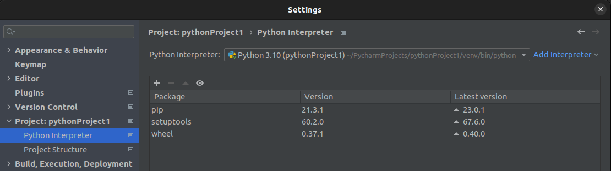

Se lo si vuole cambiare lo si può fare tramite il menù a tendina.
Se non è presente lo si può creare andando su ```Add Interpreter -> Add Local Interpreter```

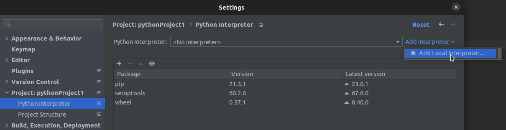

Successivamente è possibile creare un nuovo virtual environment,
che di default verrà messo all'interno della cartella *venv* nella home del progetto.
Premere ok per confermare.

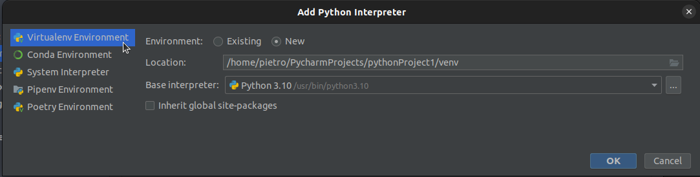

È anche possibile selezionare l'interprete di sistema.
In questo modo non verrà creato un virtual environment, perdendone i vantaggi,
e le librerie saranno installate nei *site_packages* del proprio utente di sistema.

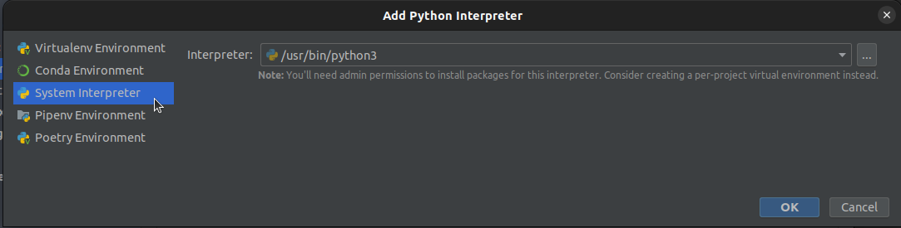


Per vedere se un environment è attivo aprire un nuovo terminale in Pycharm tramite la scheda *Terminal* in basso:

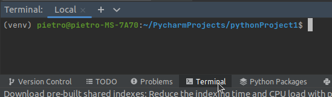

e controllare se il nome dell'environment appare tra parentesi all'inizio della stringa che appare sulla console.
Esempio:

```
(nome_virtualenv) pietro@pietro-pc:~/Documents/APOpublic$
```

**ATTENZIONE**: su windows quando is usa powershell (PS) potrebbe non comparire anche se attivo.

Per installare librerie nell'environment è possibile digitare i comandi pip all'interno di un terminale che ha l'environment attivo.
Altrimenti è possibile aprire la scheda *Python Packages* in basso e utilizzare l'interfaccia grafica messa a disposizione da PyCharm.

### VSCode <a name="vscode1"></a>
Per creare un nuovo virtual environment tramite VSCode è necessario avere il l'estensione [Python](https://marketplace.visualstudio.com/items?itemName=ms-python.python) installata
Successivamente usare la combinazione di tasti ```ctrl+shift+P``` per aprire la command palette.
Successivamente cerare il comando *Python: Create Environment...*.
Quando richiesto dalla procedura, selezionare un environment di tipo *Venv* e l'interprete globale.

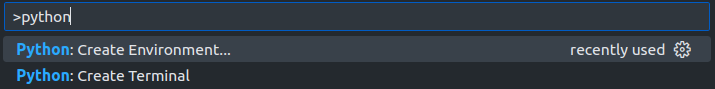

Questo creerà la cartella .venv nella home del progetto, contenente l'environment.
Una volta creato, tutti i nuovi terminali aperti in VSCode attiveranno l'environmemt automaticamente.

Per controllarlo è possibile lanciare un interprete python nel terminale e utilizzare il modulo *sys* per stampare il percorso dell'interprete.
Questo dovrà essere nella cartella *.venv* creata tramite la procedura.

```bash
python
...
>>> import sys
>>> sys.executable
'/home/Documents/lab/.venv/bin/python'
```

Per disattivare l'environment nel terminale corrente usare il seguente comando:
```bash
deactivate
```

Per cancellare l'environment bast cancellare la cartella che lo contiene.


### Terminale <a name="terminale1"></a>
Per creare un virtual environment usare il modulo python di sistema *venv*:

```python
python -m venv .my_env
```

Questo crea la cartella nascosta *.my_env* contenente il virtual environment (potete usare il nome che preferite, anche non nascosta).

Successivamente attivare l'environment:
```bash
.my_env\Scripts\activate.ps1 # Windows
source .my_env/bin/activate # MacOS and Linux
```
Tutti i comandi python usati in questa sessione del terminale useranno il virtual environment invece dell'installazione principale.

Se si vuole disattivarlo, usare il comando:
```bash
deactivate
```
Per eliminarlo, invece, basta cancellare la cartella che lo contiene.

Se create il progetto in un repository git è fortemente consigliato aggiungere al *.gitignore* la cartella che contiene il vostro virtual environment.


## Installare dal Python Package Index (PyPI)
Il [Python Package Index](https://pypi.org/) è un repository software per Python.
Chiunque può caricare le librerie che sviluppa in questo repository, rendendole accessibili a chiunque le voglia usare.

Per installare e gestire le librerie si usa il modulo *pip* (già installato con Python).
Questo può essere utilizzato direttamente tramite terminale o tramite l'interfaccia di PyCharm.


### PyCharm <a name="pycharm2"></a>
Andare nella sezione packages di PyCharm, esso mostra, in aggiunta ai *system packages*,
la lista dei pacchetti installati nell'environment attivo,
o nei *site packages* del proprio utente, se si usa l'interprete di sistema.

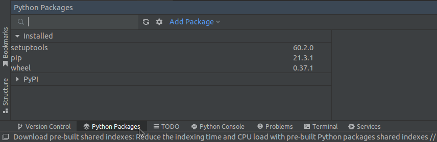

È possibile cercare pacchetti da installare tramite la barra di ricerca.
I pacchetti verranno installati nel virtual environment configurato per il progetto,
o nei *site packages* del proprio utente se si utilizza l'interprete di sistema.
Cercare il pacchetto ```matplotlib``` e installarlo.

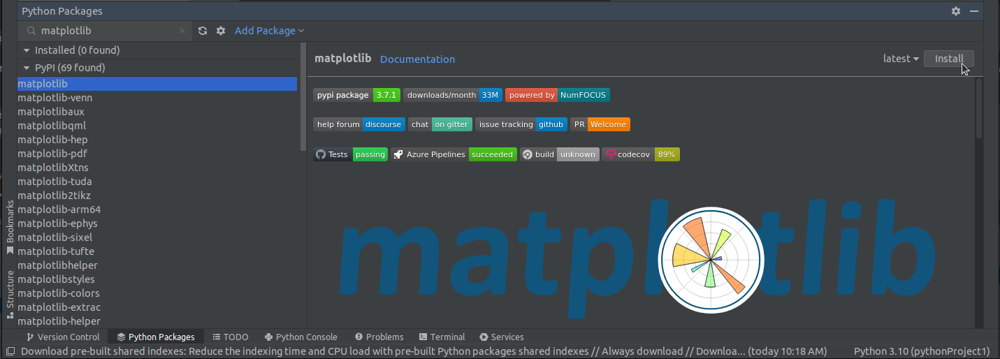

Successivamente comparirà nell'elenco dei pacchetti istallati insieme alle sue dipendenze
(altri pacchetti che servono al suo funzionamento).
Provare a usarlo, creando un script che generi un semplice grafico:

```python
import matplotlib.pyplot as plt
x = [1,2,3,4]
y = [1,23,2,4]
plt.plot(x, y)
plt.ylabel('some numbers')
plt.show()
```

È anche possibile disinstallarlo come mostrato in figura:

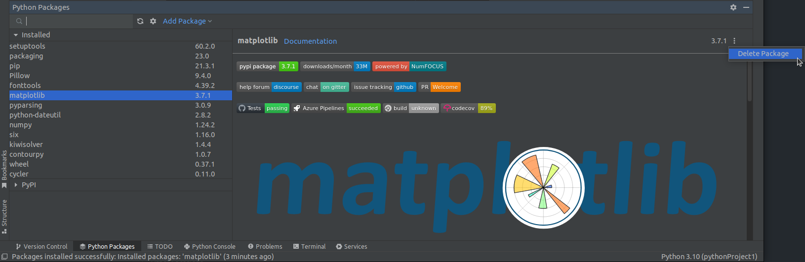


### VSCode <a name="vscode2"></a>
Seguire le istruzioni per il [Terminale](#terminale2) utilizzando il terminale di VSCode.


### Terminale <a name="terminale2"></a>
Creare un cartella principale. Creare un nuovo virtual environment e attivarlo.
Mostrare i *site packages* del virtual environment:

```bash
python -m pip freeze
```
Nulla è installato, quindi procedere a installare *matplotlib* e successivamente mostrare le librerie installate:

```bash
python -m pip install matplotlib
python -m pip freeze
```

Si vede ora che *matplotlib* è stato installato, insieme ad altre librerie che gli servono funzionare, chiamate dipendenze.
Provare a usarlo, creando un script che generi un semplice grafico:

```python
import matplotlib.pyplot as plt
x = [1,2,3,4]
y = [1,23,2,4]
plt.plot(x, y)
plt.ylabel('some numbers')
plt.show()
```
Per rimuoverlo usare

```bash
python -m pip uninstall matplotlib
python -m pip freeze
```
Come si vede il modulo è stato rimosso ma le sue dipendenze sono ancora presenti.
Questo perché è possibile che quest'ultime siano utilizzate da altre librerie installate.

## Gestire le dipendenze
Se si crea un package o un software che utilizza delle librerie e si vuol permettere ad altri di usarlo,
è necessario comunicare nome e versione delle dipendenze. 

Per farlo, è comune creare nella cartella principale un file, chiamato *requirements.txt*,
contente questo elenco.

### PyCharm <a name="pycharm3"></a>
Creando un file *requirements.txt* nella home del progetto,
PyCharm chiede in automatico se so si vuole popolare con l'elenco dei pacchetti usati dal progetto:

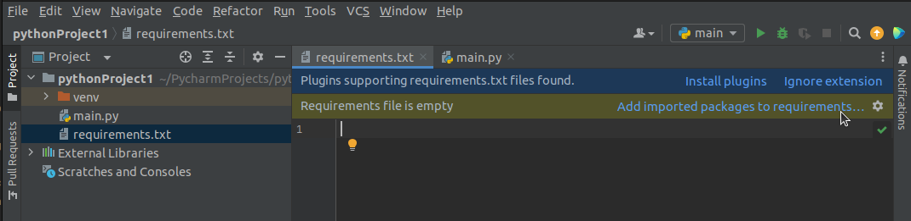

Se invece il file contiene dei requisiti non soddisfatti, viene chiesto se li si vuole installare.

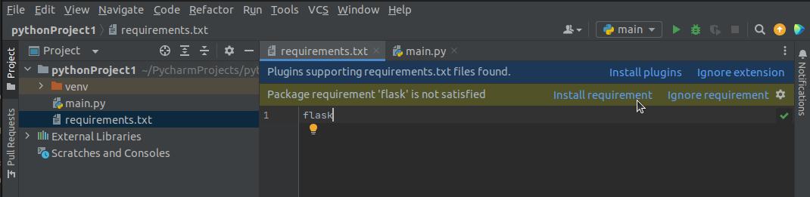

Utilizzare il file *requirements.txt* fornito insieme alla guida per installare i pacchetti in esso elencati.


### VSCode <a name="vscode3"></a>
Seguire le istruzioni per il [Terminale](#terminale3) utilizzando il terminale di VSCode.


### Terminale <a name="terminale3"></a>
Creare il file *requirements.txt*, contenente l'output di ```pip freeze``` :
```bash
python -m pip freeze > requirements.txt
```

In questo modo, prima di usare il vostro software,
l'utente può invocare il seguente comando per installare tutte le dipendenze:
``` bash
python -m pip install -r requirements.txt
```
Testarlo con il file *requirements.txt* fornito insieme alla guida.

## Python Wheel
Le librerie python, quando installate con pip, sembrano tutte uguali, ma in realtà nascondono molte differenze.

Un primo tipo di librerie sono quelle in *pure python*, ovvero il cui codice è composto solamente da moduli python.
Esistono però librerie, come ad esempio *numpy* e *scipy*, che contengono codice scritto in alti linguaggi come *Fortran*, *C* e *C++*.
Questo viene fatto per sfruttare la velocità dei linguaggi compilati nelle operazioni più intense.

Inoltre esistono librerie, come ad esempio *tkinter* e *h5py*, che non contengono la libreria in se, ma fanno da interfaccia verso una shared library installata indipendentemente sul sistema operativo (*tk* e *hdf5*).

Il primo caso non è di così difficile gestione, l'installazione consiste solamente nel copiare i file python e installare le dipendenze.
Il terzo, una volta installata indipendentemente la *shared library* e se la libreria di "interfaccia" è scritta un *pure python*, ricade nel primo.

Il caso di librerie con codice di altri linguaggi crea non pochi problemi.
Questo perché il codice, prima di essere eseguito, deve essere compilato nel linguaggio macchina specifico per l'architettura di processore usata.
E anche se questa è equivalente, il sistema operativo impone delle differenze nei formati dei file eseguibili (es. *.exe* su Windows, *ELF* in Linux e *Mach-O* in MacOS).

Chi sviluppa questo tipo di librerie fornisce diverse versioni, già compilate per la specifica architettura e sistema operativo.
Quando si invoca pip viene scaricata automaticamente la versione corretta per il sistema in uso.
Questi package binari sono chiamati *wheels* e la loro estensione è *.whl*.

Altrimenti è possibile compilarle da codice sorgente, ma in questo caso è necessario avere installato tutti i compilatori e le librerie dei linguaggi usati.
Cosa molto scomoda, che può richiede anche tempo se la libreria è vasta e rischia di fallire se il vostro sistema presenta anche leggere differenze da quello usato dagli sviluppatori.

Pertanto pip utilizza di default la versione wheel, quando questa è disponibile.

## Riferimenti
- [Virtual Environments](https://realpython.com/python-virtual-environments-a-primer/)
- [Python Wheels](https://realpython.com/python-wheels/)


